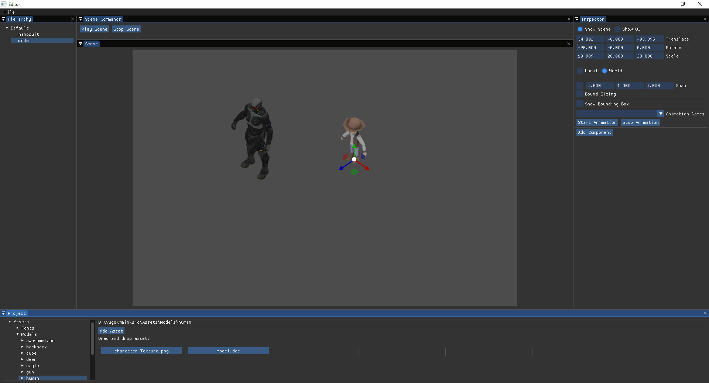

# Yugo
Yugo is a 3D game engine which is in early development phase.
Screenshot:



# Getting Started
You can clone the repository using git:
```
git clone --recursive https://github.com/bd93/Yugo.git
```
Make sure to include ```--recursive``` in order to clone all submodules.

# Info
* Folder "Main/src/Assets" is set in gitignore and thus can't be seen. 
If you want to run program, email me at dusanbabic93@gmail.com and I will send you necessary assets (shaders, textures, etc.).
* Project "GameLogic" is compiled as a dll library and it is used for game scripting. 
GameLogic dll library is linked explicitly, so scripter can recompile scripts while main program is still running.
